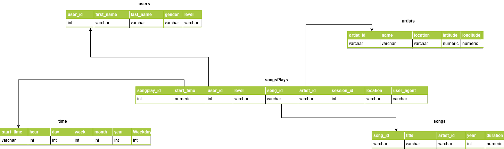

# Sparkify Database
## PURPOSE OF THE PROJECT:
The purpose of this project is to model a database for Sparkify's data analysts.
Given a collection of user logs and music library we could analise user behavior regarding which genre of music s/he likes.

## Datasets:
Song files are partitioned by the first three letters of each song's track ID.
> {"num_songs": 1, "artist_id": "ARJIE2Y1187B994AB7", "artist_latitude": null, "artist_longitude": null, "artist_location": "", "artist_name": "Line Renaud", "song_id": "SOUPIRU12A6D4FA1E1", "title": "Der Kleine Dompfaff", "duration": 152.92036, "year": 0}
> Sample of a song file

Log files are partitioned by year and month.
> {'artist': 'None', 'auth': 'Logged In', 'firstName': 'Walter', 'gender': ''M'', 'itemInSession': 0, 'lastName': 'Frye', 'length': nan, 'level': 'free', 'location': 'San Francisco-Oakland-Hayward, CA','method': 'GET','page': 'Home', 'registration': 1540919166796, 'sessionId': 38, 'song': None, 'status': 200, 'ts': 1541105830796, 'userAgent': '"Mozilla/5.0 (Macintosh; Intel Mac OS X 10_9_4) AppleWebKit/537.36 (KHTML, like Gecko) Chrome/36.0.1985.143 Safari/537.36"', 'userId': 39}
> Sample of a log file

## Database Schema:
Our database was modeled using the STAR schema, using songplays as the FACT table and the rest as DIMENSION tables.

## ETL Pipeline:
For the pipeline,
sql_queries contains all CRUD queries needed foe the project
create_tables.py create the required tables. 
etl.py contains all the logic for procceeing both logs and music library files to create our INSERT queries.
test.ipynb can be used to check the creation of tables and test some queries.